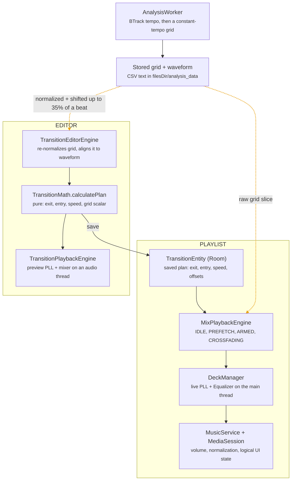

# Transitions Feature Audit

2026-10-05

## Summary

The mix feature works on the happy path, but the editor preview and real playlist playback run two separate engines on two different beat grids. A transition that sounds right in the editor is not guaranteed to sound the same in a playlist. Separately, the engine refactor introduced several regressions in **normal (non-mix) playback** that users will hit first.

Scope: everything under `transition/`, `DeckManager`, `MixPlaybackEngine`, `SimplePlaybackEngine`, the analysis pipeline (`utils/analysis/`), the editor screen and view model, and the `MusicService` / stream-resolution changes in the last five commits plus the uncommitted working tree. No code was changed.

The five things to fix first:

1. **Normal playback regressions.** Audio focus is off, volume defaults to 50% when normalization is off, the full-player seek bar doesn't advance, the sleep timer is detached, and the media session doesn't follow engine switches. See [General playback](#general-playback-non-mix).
2. **Preview ≠ playback.** Merge `TransitionPlaybackEngine` and `DeckManager` into one mixer/PLL, and make both read the same stored beat grid.
3. **Live mixer bugs.** EQ objects get attached to the wrong deck after the first swap, "Low Pass out" is silently ignored, "Dynamic Sidechain" does nothing, and interval-matched (e.g. 70 vs 140 BPM) transitions never phase-lock.
4. **Mix-mode queue.** After the first transition the active deck holds only one song, so a pair with no saved transition stops playback and Next does nothing.
5. **Control loop on the main thread.** The 20 ms PLL loop, Equalizer IPC calls and ~200 lines of banner logging run on `Dispatchers.Main`; any UI jank becomes audible drift.

## How the feature fits together

One analysis step feeds two independent paths. The editor builds and previews a plan, then saves it. The playlist path reloads that plan and replays it with its own engine.

*Dotted (orange) paths are where preview and live playback diverge.*

The saved plan is the only contract between the two sides. The grid each side reads, and the engine that executes the plan, are separate implementations. That is the root of most findings below (D1, D2).

## Performance

The biggest cost is where work runs, not how much: the live PLL loop and every Equalizer call share the UI thread. Analysis memory is the second risk, on low-end devices.

| # | Severity | Where | Finding | Suggested fix |
| --- | --- | --- | --- | --- |
| P1 | High | `DeckManager.kt:269`, `MixPlaybackEngine.kt:173` | The PLL loop (every 20 ms) and the mix poller (every 50 ms, hopping to Main each tick) run on `Dispatchers.Main`. A long frame or GC pause delays speed corrections, which is heard as drift. The editor preview already uses a dedicated `THREAD_PRIORITY_AUDIO` HandlerThread. | Build both decks on one audio `HandlerThread` looper (as `TransitionPlaybackEngine` does) and run the loop there. |
| P2 | High | `DeckManager.kt:517`, `applyDeckStateToEQ` | During a crossfade, up to ~8 `Equalizer.setBandLevel`/`getBandLevel` calls per tick, every 20 ms. Each is a binder call into the audio server. No change-detection, unlike the preview engine's `lastBassA`/`lastFilterA` cache. | Only write bands when the value changed by more than a threshold; drop the `getBandLevel` reads by tracking state locally. |
| P3 | Medium | `DeckManager.kt` throughout | ~150 `Log.e` banner lines. `DebugLog` no-ops in release, but every argument string (positions, states, `when` blocks) is still built. Several run per tick. | Delete the banners; keep a handful of `d` logs behind a `if (DEBUG)` lambda or `Log.isLoggable`. |
| P4 | Medium | `MixPlaybackEngine.kt:176` | The poller keeps waking every 50 ms forever, even when paused or when no transition is armed. | Suspend on `isPlaying` / phase changes instead of polling; only tick when `PREFETCH`/`ARMED`. |
| P5 | Medium | `DeckManager.kt:777` | `prepareNext` launches an unbounded `while (state != READY) delay(10)` with no timeout and no cancellation. An error leaves it spinning forever; repeated calls stack up loops. It also reads `standbyDeck` live, so after a swap it watches the wrong deck. | Capture the deck locally, add `withTimeoutOrNull`, and keep the Job so the next call cancels it. |
| P6 | Medium | `TransitionPlaybackEngine.kt:203` | Editor "soft-idle" keeps both decks decoding and playing silence for as long as the editor is open. Pure battery cost. | Pause decks when idle; warm them only on Play, or keep them paused-and-prepared. |
| P7 | Medium | `AnalysisWorker.kt:60`, `AudioDecoder.kt` | Analysis holds the full song in memory several times: stereo `ShortArray` + mono `FloatArray` + a low-passed copy. A 4-minute 44.1 kHz track is ~42 MB per array, so 100 MB+ peak, plus a new `ShortArray` per decoder buffer. | Decode straight to mono float in one pass, reuse the output buffer, and filter in place or in chunks. |
| P8 | Low | `SilenceAudioProcessor.kt:640` | Allocates a new `ByteBuffer` for every audio buffer while enabled, on the audio thread. | Write zeros into the output buffer directly. |
| P9 | Low | `AnalysisStorage` / `AudioDecoder.loadBeatGrid` / `TransitionEditorEngine` | Grids and waveforms are stored as comma-separated text and re-parsed with `split` (a `Regex` in one place) on every load. Waveforms are ~24k values per song. | Store as little-endian binary (`DataOutputStream` of floats/longs). |
| P10 | Low | `WaveformView.kt:127` | Every frame iterates all ~30k `BeatSample`s to find the visible ones, and each drag event launches a coroutine and pushes the offset through the view model. | Binary-search the visible range (samples are sorted), draw with one `Path`/`drawPoints`, and report the offset only on drag end. |
| P11 | Low | `TransitionMath.kt`, `TransitionPlan` | Grids are `List<Double>` (boxed). `TransitionMixer.calculateSidechainEnvelope` scans the whole grid linearly on each call. | Use `DoubleArray`; reuse the existing binary search for the envelope. |

## Correctness and concurrency

These are bugs, not style issues: each one has a concrete way to produce wrong audio, a stuck state or a crash. Items marked *verify* follow from reading the code and should be confirmed on a device.

| # | Severity | Where | What goes wrong |
| --- | --- | --- | --- |
| C1 | Critical | `DeckManager.kt:107` + `ensureEq` | `completeTransition` swaps `eqA`/`eqB`, but `ensureEq` still maps `playerA → eqA`. From the second transition on, filters and bass swaps are applied to the **wrong deck**. EQs are also never re-created when a deck's audio session changes. |
| C2 | High | `DeckManager.kt:639` vs `TransitionMixer` | Live code matches `effectMode.contains("Low pass")` case-sensitively. "Low Pass out" doesn't match, so that effect is a no-op in playlists (the preview uses `ignoreCase = true` and works). |
| C3 | High | `DeckManager.kt:507` | `getMixState` is called without a timestamp or grids, so "Dynamic Sidechain" degrades to plain Overlap (both decks at full volume) in playlists. |
| C4 | High | `DeckManager.runPllLoop` | The PLL ignores `plan.gridScalarB`. For interval-matched pairs (BPM gap > 15, e.g. 70 vs 140) it tries to lock B one-beat-per-A-beat. The speed hits the 0.8–1.2 clamp and the phase error grows for the whole transition. |
| C5 | High | `DeckManager.cancelCrossfade` | Never sets `_isCrossfading = false`, never resets the standby speed, and forces active volume to `1f`, dropping loudness normalization. After any seek mid-crossfade, the UI and the volume collector believe a crossfade is still running. |
| C6 | High | `MixPlaybackEngine.seekTo` during `CROSSFADING` | The UI has already switched to song B (`switchLogicalToNext`), so the user drags B's seek bar, but the seek is applied to deck A. |
| C7 | High | `runPllLoop` progress | Progress comes from `pA.currentPosition`. If song A ends before `exit + duration` (a transition placed near the end), position stops advancing, progress never reaches 1, and the loop runs forever with the swap never happening. *Verify.* |
| C8 | Medium | `MixPlaybackEngine.kt:271` | The arm condition requires `exitPointMs > 15 000`. Any transition whose exit point is in the first 15 s is never armed. |
| C9 | Medium | `TransitionMath.calculatePlan` | `durationMs` uses `gridA[1] - gridA[0]`, the first interval of the grid, not the interval at the anchor as documented. Live playback uses this `durationMs`; the preview uses `transitionDurationBeats`. Same transition, different lengths whenever tempo varies. |
| C10 | Medium | `TransitionMath.getBeatForTimestamp` | A duplicate beat timestamp gives a zero step: division by zero, then `NaN` reaches `setPlaybackSpeed`, which throws. The normalizer can emit near-duplicates. |
| C11 | Medium | `MixPlaybackEngine` state | `currentTransitionCache/Plan/Config` and `phase` are written from `scope` coroutines and read on Main. Only `phase` is `@Volatile`. `loadTransitionOnce` sets `PREFETCH` even when `prepareNext` was skipped because standby was playing. |
| C12 | Medium | `TransitionEditorViewModel` | `displayBpm!!` / `bpm!!` crash (or silently produce an empty editor) for songs that haven't been analysed. `hasChanges` reads `originalState`, a plain var, so it stays `true` after a save until the next edit. `_isSaving` is written from `Dispatchers.IO`. |
| C13 | Medium | `DeckManager` init | `standbyDeck = getStandby()` runs at construction and touches `playerB`, so the `by lazy` "only create Deck B when needed" never saves anything. `release()` also forces it. |
| C14 | Low | `DeckManager.kt:180` | The "strict" check `exitPointMs > 5000 && anchorBeatA < 1.0` is meaningless now that grids are partial windows: anchor indices are relative to the slice and are routinely small. |
| C15 | Low | `AudioDecoder.decodeToStereo` | Assumes 16-bit PCM output (some decoders emit float) and copies >2-channel audio as if it were stereo. |
| C16 | Low | `AnalysisWorker.kt:149` | Writes `duration = exactDurationSeconds.toInt()` back to the song row, truncating the duration the rest of the app shows. |

## Code quality

Most of the cleanup is removal: dead code, duplicated logic and debug scaffolding left over from experimenting. Getting rid of it would make the real logic much easier to follow.

**Duplicated logic (same thing written twice, already drifting apart)**

- The PLL, mixer-to-EQ mapping, `createPlayer` audio-sink setup, `resetEQ` and `SilenceAudioProcessor` wiring exist in both `DeckManager` and `TransitionPlaybackEngine`. Gains, clamps and case-sensitivity already differ (see [Consistency](#consistency)).
- The interval-match scalar is computed in `TransitionMath.calculateSyncParameters` and again in `TransitionEditorEngine.loadAndNormalizeGrids`. The comment admits it "mirrors TransitionMath".
- Beat-grid parsing exists twice (`AudioDecoder.loadBeatGrid` returning `List<Float>` and `TransitionEditorEngine.loadBeatGridDouble` returning seconds). So does `generateSimpleGrid`, marked "Copied from MusicService".
- Song rows are loaded twice per transition (`loadTransitionOnce` and `performLazyLoading`).

**Dead code**

- `AnalysisWorker`: `calculateGridScore`, `findAnchorBeat`, `generateDynamicGrid`, `snapSingleBeat`, `snapGridToTransients`, `backfillStartBeats` and `toMillisLongArray` are never called (~250 lines). The `Amplituda` instance is created for every job but only used in commented-out code.
- `BeatGridNormalizer.normalizeWithMedianInterval` and the `visual` half of `DualGrid` are unused.
- `DeckManager.startPllTransition`: `prerollSeconds` and `startB` are computed and never used. `TransitionPlan.transitionDurationBeats` and `gridScalarB` are never read by the live engine.
- `MixPlaybackEngine.loadTransitionOnce`: the `hasGridA/hasGridB` check only logs and has no effect.
- `MusicService`: `_logicalIndex`, `currentTransitionCache`, `isActiveDeckPlaying` and a 30-line commented-out `ExoPlayer.Builder`.
- `TransitionEditorViewModel.init`: two collectors that only log, plus `.onEach { Log.d }` on two flows.

**Stringly-typed modes**

Overlap, EQ and effect modes are free-form `String`s compared in four places (`TransitionMixer`, both engines, the editor screen) with inconsistent casing: `"Low pass in"` vs `"Low Pass out"`, `"Centre Bass swap"` vs `"End Bass Swap"`. That's the root cause of C2. Track `"A"`/`"B"` is also a `String`. These should be enums stored via a Room `TypeConverter`, with display labels in `strings.xml`.

**Logging and comments**

- `DeckManager` is about 40% logging: box-drawing banners, emoji, and `Log.e` for normal events. That hides real errors in logcat and makes the control logic hard to read.
- `DebugLog` is used in two files while the rest of the feature uses `android.util.Log` or `androidx.media3.common.util.Log` directly.
- Comments narrate the debugging process ("CRITICAL FIX", "This circular dependency lazy logic is tricky. Let's just rely on logic:", "No, Silence processor is for the IDLE state."). Replace them with a short statement of the invariant, or delete them.
- Swallowed exceptions: `applyDeckStateToEQ` (live) has an empty catch with the log commented out; `loadGrid` returns `null` on any exception without logging.

**Magic numbers**

PLL gains (0.35/0.08, 0.1, 0.04 + 0.5·(1−mix)), clamps (0.8–1.2, 0.5–2.0), lead times (3 s, 5 s, 10 s, 15 s), the 50 ms "monitoring delay", the −1500 mB EQ floor, the 15 BPM interval-match threshold, and the grid window margins are scattered literals. Collect them in one `MixTuning` object so preview and live share them.

**Smaller items**

- `TransitionState.Custom.isManual()` compares against literal `0` instead of `TransitionEntity.TYPE_MANUAL`; `String.format` without a `Locale`.
- `saveTransition` adds an artificial 500 ms delay and hardcodes `syncTempo = true`.
- The editor's effect icons are placeholder letters (`"x"`, `"y"`, `"z"`, `"d"`), and the EQ icon `when` has branches (`"Low pass"`, `"High pass"`) that can never match.
- `TransitionEntity` stores the length three ways (`durationMs`, `durationBeats: Int`, `transitionDurationBeats: Double`), with different defaults: 8000 ms, 32 beats on restore, and 16 beats from `TransitionConfig(barsCount = 4)`.

## Design and architecture

The overall shape is sound: analyse once, plan in pure math, persist the plan, replay it. The problems come from having two copies of each stage and from steering ExoPlayer with a feedback loop it wasn't built for.

**What's already working well:** `TransitionMath` is pure and testable. Persisting the plan (`planVersion`, `initialSpeedB`, offsets) is the right contract. The `MixPhase` state machine and its doc comment are clear. Moving analysis artifacts from `cacheDir` to `filesDir` with a migration was a good catch. `DebugLog` is the right idea.

**D1. One engine for preview and playback.** `TransitionPlaybackEngine` (editor) and `DeckManager` (playlist) do the same job with different code, so the editor can't promise what the playlist will play. Extract a single `MixRenderer` that takes a `TransitionPlan` + `TransitionConfig` and two players, with tuning constants in one place. The editor and `MixPlaybackEngine` should be thin callers.

**D2. One beat grid, decided at analysis time.** `AnalysisWorker` already writes a constant-tempo grid. The editor then runs it through `BeatGridNormalizer` (adaptive "magnet" tempo + phase nudging) and shifts the whole grid by up to ±35% of a beat (`alignGridToWaveform`). Exit/entry timestamps are saved against *that* grid, but live playback loads the *raw* stored grid. Any offset the editor applied becomes a built-in phase error at playback. Do any normalization or alignment once, in the worker, and store the result. Both sides should then load the same file through one function.

**D3. Rethink the PLL.** With constant-tempo grids, B only needs a fixed speed ratio and an accurate start. The loop mostly fights noise in `currentPosition` (interpolated, not output-latency-compensated) and the latency of Sonic speed changes (buffered audio still plays at the old speed). That delay is why a PD controller with these gains overshoots, and why the code grew "predicted position" workarounds. Short term: lower the gains, add hysteresis, and update at most every 100–200 ms. Long term, the approach mixing apps actually use is to mix both decoded streams in one place (a custom `AudioProcessor` or a single `AudioTrack`) at sample accuracy. Then there is no clock to chase. The deleted `StreamingPcmSource`/`CircularPcmBuffer` were heading that way.

**D4. Replace `android.media.audiofx.Equalizer` for filters.** It is a device-dependent 5-band graphic EQ with roughly a −15 dB floor. A "low-pass" is really a gentle shelf, and results vary by phone. It also attaches to the same session the user's system EQ uses (`openAudioEffectSession`). A small biquad `AudioProcessor` per deck gives real LPF/HPF/low-shelf curves, sample-accurate automation and no binder calls. That also fixes P2 and C1.

**D5. When the UI switches songs.** The UI flips to song B when the PLL starts, about 3 s before B is audible (it's muted during preroll). The seek bar then jumps from 0 to B's entry point minus 3 s, and the logical duration of A is cut to the exit point. Switch the metadata at the crossfade midpoint (progress 0.5) and keep one consistent timeline rule.

**D6. One owner for transition state.** The phase lives in `MixPlaybackEngine`, while `isCrossfading`, `fadeJob` and the deck roles live in `DeckManager`, so the two can disagree (C5). Make `DeckManager` a stateless executor that reports completion, and keep all decisions in the state machine.

**D7. Queue ownership in mix mode.** `QueueBoard` loads the whole queue into whichever deck is active, but `prepareNext` gives the standby deck a single item. After a swap, ExoPlayer's playlist and the app's queue no longer match (see G5). Either keep the full queue on the active deck after every swap, or have the engine drive advancement itself and treat each deck as single-item.

**D8. Load full grids once.** Partial-window grids make every anchor index relative to an arbitrary slice (and caused C14). A full grid is ~500 doubles. Load it once per song, cache it, and use absolute beat indices everywhere.

## Consistency

The editor preview and live playback disagree on nearly every parameter that shapes the sound. Each row below is a way the saved transition can play differently from what was previewed.

| Aspect | Editor preview (`TransitionPlaybackEngine`) | Playlist (`DeckManager` / `MixPlaybackEngine`) |
| --- | --- | --- |
| Beat grid | Normalized (`resolveDjGrids`) + shifted by `alignGridToWaveform` | Raw stored grid, partial window |
| Transition length | `transitionDurationBeats` (beats) | `durationMs` from the grid's first interval |
| Preroll | Seek A and B 3 s early; hard re-seek of B if error > 0.2 beat | Seek B only; no re-seek; PD speed nudging |
| PLL gains / clamps | `kp = 0.04 + 0.5·(1−volB)`, ±0.1, speed 0.5–2.0 | Preroll `kp 0.35, kd 0.08`, speed 0.8–1.2; crossfade `kp 0.1`, 0.5–2.0 |
| Phase wrapping | Wraps error to ±0.5 beat during crossfade | No wrapping |
| Interval match (`gridScalarB`) | Used for preroll length | Ignored (C4) |
| Sidechain | Implemented | No-op (C3) |
| Filter mode matching | Case-insensitive | Case-sensitive; "Low Pass out" ignored (C2) |
| EQ floor | `bandLevelRange[0]` | Hard-coded −1500 mB |
| EQ updates | Only on change > 0.01 | Every 20 ms tick |
| Loudness normalization | None (both decks at 1.0) | Applied to B; A keeps its current volume |
| Thread | Dedicated audio `HandlerThread` | Main thread |
| Loop period | 16 ms | 20 ms (+ 50 ms poller) |
| Data source | Local file only (`localPath`) | Full app data source (cache, streams) |
| Float output | Default | `setEnableFloatOutput(enableFloatOutput)` |

Consistency with the rest of the codebase:

- **Logging:** three different `Log` classes (`android.util.Log`, media3 `Log`, `DebugLog` aliased as `Log`) across one feature.
- **Strings:** all editor labels, mode names and error messages ("Deck A Failed to Warm Up") are hard-coded English. The rest of OuterTune uses `stringResource`.
- **Dependency injection:** `TransitionEditorEngine` and `TransitionPlaybackEngine` are created by hand inside the view model, and `MixPlaybackEngine` inside `MusicService.playQueue`. Elsewhere the app uses Hilt.
- **Package layout:** transition code is split across `transition/`, `playback/`, `utils/` (`TransitionMixer`, `DeckState`) and `utils/analysis/`. `DeckState` and `TransitionMixer` belong in `transition/`.
- **Units:** times are passed as ms `Long`, seconds `Double`, seconds `Float` and ms `Float` depending on the file. `LogicalPlayerState.durationMs` is set from `nextSong.duration * 1000L` in one place and `player.duration` in another.

## General playback (non-mix)

The engine split (`SimplePlaybackEngine` / `MixPlaybackEngine`) introduced regressions that affect every user, mix mode or not. These should be fixed before any transition work. The stream-resolution changes in the working tree are solid, with a few edges noted below.

**Playback engine and `MusicService`**

| # | Severity | Where | Finding |
| --- | --- | --- | --- |
| G1 | Critical | `MusicService.createExoPlayer` | `setAudioAttributes(..., false)`: audio focus handling was `true` before commit c43f9620. Music no longer pauses for calls, alarms or other apps, and doesn't duck for navigation. The mix decks also pass `false`, and nothing manages focus manually. |
| G2 | High | `MusicService.kt:416` | `normalizeFactor` falls back to `0.5f` whenever normalization is **off** or loudness is unknown (commit 85290842). Users who disabled normalization, and most local files, now play 6 dB quieter. In mix mode the incoming deck uses `1f` for unknown loudness, then the service collector applies `0.5f` after the swap: an audible 6 dB drop at the end of each transition. |
| G3 | High | `Player.kt:234` | The full player now reads position from `logicalState`. In simple mode that state only updates on timeline/discontinuity events, so the seek bar shouldn't advance during normal playback. *Verify on device.* |
| G4 | High | `MusicService.onCreate` | `snapshotFlow { playbackEngine }` only tracks Compose `State`; `playbackEngine` is a plain `var`, so it emits once. After `playQueue` switches engines, `mediaSession.player` keeps pointing to the destroyed player: notification, lock screen and Bluetooth controls stop working, and deck swaps in mix mode aren't forwarded. The volume `combine` captures the first engine's `isCrossfading` the same way, and `skipSilenceEnabled` is only applied to the startup player. Use a `MutableStateFlow<PlaybackEngine>`. |
| G5 | High | `DeckManager.prepareNext` + `QueueBoard` | After a mix swap the active deck holds one media item (D7). For a pair with no saved transition, playback ends instead of advancing, and Next/Previous in the notification are disabled. *Verify.* |
| G6 | Medium | `MusicService.kt:299` | `SleepTimer` gets the startup player and is never added as a listener (it used to be `deckManager.addListener(sleepTimer)`). "End of song" mode never fires, and after an engine switch the timer pauses a released player. |
| G7 | Medium | `DeckManager.createPlayer` | Mix decks skip `createRenderersFactory`, so the user's decoder preference, offload and FFmpeg metadata settings are ignored. There's no `WAKE_MODE_NETWORK`, so streamed songs can stall with the screen off, and no seek increments. |
| G8 | Medium | `Player.kt:603`, `Queue.kt:1021` | The ±5 s buttons call `player.seekTo` directly and bypass `seekToLogical`, so in mix mode they don't reset an armed transition. |
| G9 | Low | `MusicService.kt:321` | `PlaybackStatsListener` is never attached (commented out before these commits), so `onPlaybackStatsReady` never runs: no play counts, local history or YouTube history. Confirm whether that's intentional. |
| G10 | Low | `MusicService.onDestroy` | Releases `mediaSession.player` and then `playbackEngine.destroy()` releases it again. Each engine switch also creates a fresh audio session, so external EQ apps lose their session. |

**Stream resolution (uncommitted)**

Passing `streamHeaders` through the cache, `DataSpec` and `DownloadManagerOt` is done consistently. Always validating with a ranged GET is better than the old HEAD. The one-retry cap on the yt-dlp download fallback is sensible. Remaining points:

- **First-play latency.** Every client is now validated with a network round trip before the next is tried, so the worst case is four sequential probes plus a yt-dlp (Python) start-up, all inside `ResolvingDataSource` on the loader thread. Consider a parallel probe or a per-session "last good client".
- **Per-deck URL caches.** `DeckManager` calls `createDataSourceFactory()` once per deck, and each call builds its own `songUrlCache`, so deck B re-resolves URLs deck A already has. Hoist the cache to the service and make it a `ConcurrentHashMap`; resolution runs on loader threads.
- **Fragile 403 detection.** `DownloadUtil` matches `"403"`/`"Forbidden"` in the exception message. Surface the HTTP status code from `DownloadManagerOt` instead.
- **Fixed 1 h expiry.** yt-dlp URLs get a hard-coded 3600 s lifetime; googlevideo URLs carry an `expire=` query parameter you can read.
- **Placeholder format rows.** The synthetic `Format` (itag −1, `loudnessDb = null`) is persisted for yt-dlp downloads, which then hit the G2 0.5× volume fallback.
- **Start-up threads.** `App.onCreate` starts two raw `Thread`s. Prefer the app's existing coroutine scope so failures are logged consistently. `android:extractNativeLibs="true"` (needed for the bundled Python) increases install size; worth a comment in the manifest.

## Recommended order of work

Fix user-facing regressions first, then make preview and playback agree, then simplify. Each phase can ship on its own.

**Phase 1: stop the bleeding (small, isolated fixes)**

- [ ] G1 Restore audio focus (`true`) in `createExoPlayer`, and decide how the mix decks share focus
- [ ] G2 Fall back to `1f` when normalization is off; use one fallback value in both engines
- [ ] G4 Make the engine a `StateFlow` so the media session, volume and skip-silence follow engine switches
- [ ] G3 Tick `logicalState` in simple mode, or read the position from the player there
- [ ] G6 Re-attach the sleep timer to the active player on every switch or swap
- [ ] C1 Key EQs by player, not by the A/B slot, and stop swapping them
- [ ] C2 Case-insensitive filter matching (as a stopgap until enums)
- [ ] C5 Reset `isCrossfading`, speed and normalized volume in `cancelCrossfade`
- [ ] C7 Also end the crossfade on `STATE_ENDED` or after a wall-clock timeout

**Phase 2: one source of truth**

- [ ] D2 Move grid normalization and alignment into `AnalysisWorker`; one `BeatGridRepository.load(songId)` used by editor and playback
- [ ] D1 Extract one `MixRenderer` (PLL + mixer + EQ + tuning constants) used by the editor and `DeckManager`
- [ ] C4 Apply `gridScalarB` in the shared PLL; C3 pass timestamps and grids so sidechain works live
- [ ] C9 Compute length from beats everywhere; collapse the three duration fields in `TransitionEntity`
- [ ] Replace mode strings with enums plus a Room `TypeConverter` and a migration of existing rows
- [ ] G5 / D7 Decide queue ownership across deck swaps

**Phase 3: performance and cleanup**

- [ ] P1 Run decks and the control loop on a dedicated audio looper
- [ ] P2 Change-detect EQ writes, or D4: replace `Equalizer` with a biquad `AudioProcessor`
- [ ] P3 Delete banner logging; standardize on `DebugLog`
- [ ] Delete the dead code listed under [Code quality](#code-quality)
- [ ] P7 Single-pass mono decode in analysis; P9 binary artifact files
- [ ] Add unit tests for `TransitionMath` and `TransitionMixer` (both are pure and easy to test)

**Phase 4 (optional, larger): sample-accurate mixing**

- [ ] D3 Prototype mixing both streams in one `AudioProcessor`/`AudioTrack` with a fixed time-stretch ratio, which removes the need for a PLL
