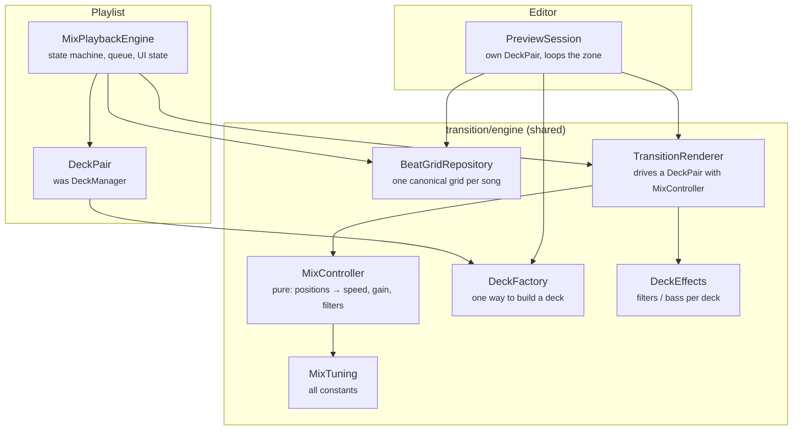

# Transitions Remediation Plan

2026-10-05 · Companion to [TRANSITIONS_AUDIT.md](TRANSITIONS_AUDIT.md). Issue IDs (P/C/D/G) refer to that document.

## Status

| Phase | State | Branch |
| --- | --- | --- |
| 0, 1 | Done; needs the manual test matrix on a device | `fix/phase-0-1-playback` |
| 2 | Done except 2.8 (on-device parity check); needs the manual test matrix | `feature/unified-mix-engine` |
| 3 | Done; needs the manual test matrix | `chore/phase-3-cleanup` |
| 4 | Not started | |

Where Phase 2 as built differs from the steps below:

- Grids stay `List<Double>` rather than `DoubleArray` (P11's boxing cost is small at ~500 beats; left for Phase 3).
- The editor preview plays local files only (`DefaultDataSource`), as before; streaming in the editor would need the service's data source.
- No "re-check this transition" flag yet when a song's BPM changes; the grid is rebuilt automatically, but saved transitions on it are not marked.
- Waveforms moved to binary as part of 2.2 (P9).
- Tick work stays on the main looper (decision 2); `MixDiagnostics` lines will show whether that's enough.

Phase 3 notes:

- Grids are still `List<Double>` (P11 deferred again; small cost, wide API change).
- Key detection is unfinished: `KeyDetector` and its native code exist, but nothing has ever called them, so `song.key` is never set. Left off because the native path has never run.
- `DebugLog` warnings and errors now log in release builds too; debug/info stay debug-only.

## Goal

When this plan is done, a transition plays the same in the editor as in a playlist, because both run **the same engine on the same beat grid**. Normal (non-mix) playback is back to its pre-refactor behaviour, and the codebase has one implementation of each concept instead of two.

The work is split into five phases. Phase 1 is small and should ship on its own as soon as possible. Phase 2 is the engine unification: the largest piece, done as eight steps that each leave the app working. Phases 3–4 are cleanup and optional improvements.

| Phase | What | Size | Ships independently |
| --- | --- | --- | --- |
| 0 | Safety net: branch, tests for pure code, diagnostics | S | yes |
| 1 | Normal-playback regressions (G1–G10) + critical mix hot-fixes | M | yes |
| 2 | **Unified mix engine** (D1, D2, D6, D7 and most C-issues) | XL | after each step |
| 3 | Performance and cleanup | M | yes |
| 4 | Optional: biquad filters, then sample-accurate mixing | L | yes |

---

## Phase 0: Safety net

Before restructuring an audio engine, make regressions visible.

1. **Commit or stash the current working tree** on its own branch (`yt-dlp-fallback`), separate from the mix work. It mixes stream-resolution, schema and engine changes that should be reviewed separately.
2. **Unit tests for the pure code** in `app/src/test`:
   - `TransitionMath`: `getBeatForTimestamp` / `getTimestampForBeat` round-trip, extrapolation, duplicate timestamps (C10 reproduction), `calculatePlan` for a same-tempo pair and a 70/140 pair.
   - `TransitionMixer`: each mode at progress 0, 0.5, 1; mode-name matching.
3. **Mix diagnostics.** Add a small `MixDiagnostics` recorder (debug builds only) with one summary line per transition: phase error at unmute, max and RMS phase error during the crossfade, number of speed changes, and whether it completed or was cancelled. This becomes the parity metric in Phase 2.
4. **Manual test matrix**, written down once and re-run at the end of each phase:

| # | Scenario |
| --- | --- |
| M1 | Normal playlist: play, pause, seek bar moves, skip, notification controls, lock screen, Bluetooth |
| M2 | Normal playback with a phone call / another app taking audio focus |
| M3 | Normalization on vs off; local file vs streamed song (volume level) |
| M4 | Sleep timer: fixed time and end-of-song |
| M5 | Mix playlist: 3+ songs, every pair has a transition |
| M6 | Mix playlist where one pair has **no** transition |
| M7 | Mix: seek during PREFETCH, ARMED and mid-crossfade; ±5 s buttons |
| M8 | Mix: same-tempo pair, ~10 BPM apart, 70/140 pair |
| M9 | Mix: each overlap / EQ / effect mode |
| M10 | Editor: open, preview, change mode while previewing, save, reopen |
| M11 | Switch between a mix playlist and a normal playlist and back |

---

## Phase 1: Normal-playback regressions and critical hot-fixes

These are independent of the engine redesign, and Phase 2 builds on them. Each is a small diff.

| Step | Fixes | Change |
| --- | --- | --- |
| 1.1 | G1 | `createExoPlayer`: pass `handleAudioFocus = true`. In `DeckManager.createPlayer`, give focus handling to deck A only for now (Phase 2 replaces this with a proper owner; see 2.4). |
| 1.2 | G2 | `normalizeFactor`: return `1f` when normalization is off. When loudness is unknown, use one shared constant in both `MusicService` and `MixPlaybackEngine` (recommend `1f`; the "burst while loading" concern is better handled by not starting playback until the format row is read). |
| 1.3 | G4, G10 | Replace `private var playbackEngine` with `MutableStateFlow<PlaybackEngine>`. Drive `mediaSession.player`, `_activePlayer`, the volume `combine` and `skipSilenceEnabled` from `engine.flatMapLatest { it.activePlayer }`. Remove `snapshotFlow`. In `onDestroy`, release through the engine only. |
| 1.4 | G3 | Simple mode: tick `logicalState` (or have `Player.kt` read `player.currentPosition` directly when not in mix mode) at the same cadence the old `position` state used. |
| 1.5 | G6 | Re-bind `SleepTimer` to the active player whenever it changes (collect the same flow as 1.3); add it as a listener again. |
| 1.6 | G8 | Route the ±5 s buttons in `Player.kt` and `Queue.kt` through `seekToLogical`. |
| 1.7 | G9 | Decide whether play counts/history are intentionally off. If not, attach `PlaybackStatsListener` to each player as it becomes active. |
| 1.8 | C1 | Hot-fix: key Equalizers by player identity (`Map<ExoPlayer, Equalizer>`), delete the `eqA`/`eqB` swap. |
| 1.9 | C2 | Hot-fix: `contains(..., ignoreCase = true)` in `DeckManager.applyDeckStateToEQ`. |
| 1.10 | C5, C7 | Hot-fix: `cancelCrossfade` resets `_isCrossfading`, standby speed and the normalized volume. `runPllLoop` also exits on `pA.playbackState == STATE_ENDED` or after `durationMs + 5 s` wall-clock. |
| 1.11 | stream items | Hoist `songUrlCache` to the service as a `ConcurrentHashMap`; carry the HTTP status code in the download failure event instead of matching `"403"`; read `expire=` from yt-dlp URLs. |

**Done when:** M1–M4 and M11 pass, and M5/M7 no longer get stuck.

Hot-fixes 1.8–1.10 are throwaway: the code they touch is replaced in Phase 2. They're worth doing because Phase 2 takes a while.

---

## Phase 2: Unified mix engine

### Target architecture

One engine core, used by both the editor and the playlist. Everything that decides *what the audio does* is shared; only *where the decks come from* and *what happens after the transition* differ.

What gets deleted: `TransitionPlaybackEngine`, the PLL, mixer and EQ code in `DeckManager`, `TransitionEditorEngine.loadAndNormalizeGrids`'s scalar copy, both grid parsers, and `MixPlaybackEngine.generateSimpleGrid` / `loadGrid`.

### Key design decisions

1. **The canonical grid is the one the editor uses today.** Saved transitions store absolute exit/entry timestamps that were picked against the editor's grid (normalized + waveform-aligned). If that exact grid becomes the stored one, every existing transition becomes *correct* in playlists without touching its row. Choosing the raw grid instead would silently shift every saved transition.
2. **Shared code runs on the application (main) looper for both callers.** Media3 requires every player given to a `MediaSession` to share the session's application looper, so the playlist decks can't move to an audio thread without moving the whole service. Instead, P1 is solved by making each tick cheap (2.4, 2.5), and later by moving automation into the audio pipeline (Phase 4). The editor moves to the main looper too, so both callers have identical timing.
3. **The controller is pure Kotlin.** `MixController.step(input) → output` takes positions, time and plan, and returns target speed, per-deck gain and filter state. No ExoPlayer, no Android. This is what makes the PLL testable with simulated decks (latency, jitter, 70/140 tempo), and what guarantees preview/playlist parity: same inputs, same outputs.
4. **Length is measured in beats.** `transitionDurationBeats` is canonical; milliseconds are always derived from the grid at the anchor.
5. **The renderer owns the transition lifecycle; callers own context.** `TransitionRenderer` reports `Completed` / `Cancelled(reason)` / `Failed(reason)`. `MixPlaybackEngine` decides what that means for the queue and UI. `PreviewSession` decides whether to loop.

### Steps

Each step compiles, ships, and passes the test matrix. Steps 2.1–2.5 add the new code alongside the old; 2.6 and 2.7 switch callers over; 2.8 verifies.

#### 2.1 Shared types and schema

- Add `transition/model/MixModes.kt`: `enum OverlapMode`, `EqMode`, `EffectMode` (with `fromLegacy(String)` that matches case-insensitively), and `enum Deck { A, B }` replacing `"A"`/`"B"`.
- Add `transition/engine/MixTuning.kt`: every gain, clamp, lead time, threshold and margin listed in the audit's *Magic numbers*, in one object.
- `TransitionEntity` → Room migration 27→28:
  - store modes as enums via a `TypeConverter`; the migration rewrites existing strings through `fromLegacy`;
  - make `transitionDurationBeats` the length (backfill from `durationBeats`, default 16 to match `TransitionConfig(barsCount = 4)`); drop `durationMs` and `durationBeats`;
  - bump `PLAN_VERSION` to 2 (meaning "timestamps are against the canonical grid").
- Update `TransitionMixer`, `TransitionConfig`, the editor screen and the view model to use the enums. Labels move to `strings.xml`; real icons replace `"x"`/`"y"`/`"z"`/`"d"`.

Fixes: C2 (permanently), the stringly-typed modes, duration triplication (code quality), consistent defaults.

#### 2.2 BeatGridRepository and canonical grids

- New `transition/engine/BeatGridRepository` (Hilt `@Singleton`): `suspend fun grid(songId): BeatGrid?` where `BeatGrid` wraps a `DoubleArray` of seconds plus `version`. It has a small LRU cache (about 8 songs) and is the **only** reader of grid files.
- Canonical grid = today's editor pipeline: `BeatGridNormalizer.resolveDjGrids(...).sync`, then `alignGridToWaveform`. Move both into a `CanonicalGrid.build(...)` function used by:
  - `AnalysisWorker`, which writes the canonical grid for newly analysed songs;
  - the repository's **lazy upgrade**: when it finds an old-format (CSV, raw) grid, it builds the canonical grid, writes it in the new binary format with `version = 2`, and keeps the old file until the write succeeds.
- New on-disk format: little-endian binary (`magic, version, count, doubles`). Waveforms move to binary at the same time (P9).
- Sanitize on build: drop duplicates and non-increasing beats (fixes C10 at the source; keep the guard in `TransitionMath` too).
- Always load full grids (D8). Remove partial-window loading and `MixPlaybackEngine.loadGrid` / `generateSimpleGrid`. A BPM-only fallback grid, if kept, lives in the repository.
- Rule: if a song's `displayBpm` changes, invalidate its canonical grid. Existing transitions on that song are then flagged in the editor ("grid changed; re-check this transition").

Fixes: D2, D8, C10, C14, P9, duplicated parsers.

#### 2.3 MixController (pure PLL + mixer)

- New `transition/engine/MixController`. Input per tick: `nowMs`, `posA`, `posB` (seconds), `plan`, `config`, current applied speed. Output: `speedB` (or null = unchanged), `gainA`, `gainB`, `DeckState` A/B, `phase` (`PREROLL` / `CROSSFADE` / `DONE`), `phaseErrorBeats`.
- One control law for both callers, taken from the better parts of each engine:
  - preroll: one corrective re-seek if |error| > `MixTuning.reseekThresholdBeats` (the preview approach, which converges faster than speed nudging), then proportional correction only;
  - crossfade: low-gain proportional correction with hysteresis and a minimum interval between speed changes (`MixTuning.speedUpdateMinIntervalMs`, about 150 ms), since Sonic's buffering makes faster updates oscillate (D3, short-term);
  - phase error wrapped to ±0.5 beat;
  - **target beat on B = `anchorB + elapsedA × gridScalarB`** (fixes C4);
  - progress = elapsed **beats** / `transitionDurationBeats` (fixes C9);
  - sidechain receives the timestamps and grids it needs (fixes C3).
- Delete `TransitionMixer`'s linear sidechain scan in favour of binary search over the `DoubleArray` (P11).
- Tests with a `SimulatedDeck` (configurable speed-change latency, position jitter, start offset): converges within N beats for same-tempo, ±8% and 70/140 pairs; never exceeds speed clamps; same inputs give identical outputs.

#### 2.4 DeckFactory and DeckEffects

- `DeckFactory` (injected): builds an `ExoPlayer` for mixing with the service's data source factory (streamed songs work in the editor too), the user's decoder preference, `WAKE_MODE_NETWORK`, seek increments and the audio-processor chain. Offload stays off for mix decks (offload bypasses audio processors); document that.
- Audio focus: the playlist's active deck handles focus. On swap, focus handling moves with the active role (set `setAudioAttributes(attrs, handleAudioFocus)` on swap). The editor's preview pair requests focus while previewing, which also pauses main playback.
- `DeckEffects` interface, `apply(deck, DeckState)` + `reset(deck)`. First implementation: `EqualizerDeckEffects`, moved out of `DeckManager` and fixed: keyed per player (C1), floor from `bandLevelRange` instead of −1500, writes only on change > threshold with no `getBandLevel` reads (P2), recreated when the audio session id changes.
- `SilenceAudioProcessor` is no longer needed: decks stay paused-and-prepared instead of "soft-idle" (P6, P8). Remove it once 2.6 and 2.7 have landed.

Fixes: G7, C1, P2, P6, P8, duplicated `createPlayer`.

#### 2.5 TransitionRenderer

- `TransitionRenderer.run(pair: DeckPair, plan, config, gains): TransitionResult` (a suspend function on the main dispatcher). Preconditions: deck A is playing at or before `anchorA − preroll`; deck B is prepared.
- Responsibilities: seek B, start B, tick `MixController` every 20 ms, apply speed/gain/effects, end on `DONE`, and return `Completed`. It returns `Cancelled` on coroutine cancellation and `Failed` if A ends, a deck errors, or a wall-clock budget is exceeded (fixes C7 for good). On any exit it resets speed, effects and gains to their resting values (fixes C5 for good).
- `gains` = per-deck loudness normalization × user volume, supplied by the caller and identical in editor and playlist (fixes the normalization row in the consistency table, and the volume jump at swap noted in G2).
- No logging inside the tick except via `MixDiagnostics` (P3).

#### 2.6 Port the editor preview

- `PreviewSession` (owned by `TransitionEditorViewModel`, created through Hilt): gets grids from `BeatGridRepository`, builds a `DeckPair` via `DeckFactory`, seeks A to `anchorA − preroll`, plays, and calls `TransitionRenderer.run`. Loop-on-complete is a preview option.
- `TransitionEditorEngine` keeps only waveform/marker generation and reads grids from the repository. Its scalar computation is deleted in favour of `TransitionMath`.
- View model: drop the `!!`s (show "analyse this song first" instead; C12), make `originalState` a `StateFlow` so `hasChanges` resets after save, drop the 500 ms delay and the debug collectors, save `PLAN_VERSION = 2`.
- **Delete `TransitionPlaybackEngine`.**

#### 2.7 Port playlist playback

- `DeckManager` becomes `DeckPair`: two decks from `DeckFactory`, active/standby roles, `prepareStandby(item, startMs)` with a timeout and cancellation (P5), `swap()`. No PLL, mixer, EQ or crossfade state (D6). Deck B is created on first use for real (C13).
- `MixPlaybackEngine` keeps the `MixPhase` state machine and is the single owner of transition state:
  - `ARMED → CROSSFADING` launches `renderer.run(...)` in a Job; the result drives the next phase. `Completed` → `swap()`, advance queue; `Failed`/`Cancelled` → reset, let A play on.
  - **Queue ownership (G5/D7):** after `swap()`, call `queueBoard.setCurrQueue()`. Its existing "current item already playing" path (`QueueBoard.kt:777`) rebuilds the playlist around the playing item without interrupting it, so the active deck always holds the full queue and pairs without a transition advance normally.
  - **UI switch at the crossfade midpoint** (D5) using progress from the renderer; `LogicalPlayerState` gets one rule: before the midpoint show A, after it show B with B's real position.
  - **Seek during a transition (C6):** after the midpoint a seek means "seek in B": cancel the renderer, complete the swap immediately, and seek B. Before the midpoint it cancels and seeks A.
  - Arm based on time remaining, not absolute position, so exit points under 15 s work (C8).
  - Poll only while `PREFETCH`/`ARMED` and playing (P4).
  - All mutable state confined to the main dispatcher; remove the `scope` writes (C11).
- `MusicService` gets the active deck through the engine `StateFlow` from 1.3, so deck swaps update the media session automatically.

#### 2.8 Parity verification

- For each pair in M8, play the transition in the editor and in a playlist and compare the `MixDiagnostics` lines. **Acceptance:** phase error at unmute and RMS error during the crossfade within 0.03 beat of each other, and both under 0.05 beat (about 25 ms at 120 BPM).
- Re-run the full test matrix.
- Update `MixTuning` from the measurements if needed. Since both paths share it, tuning one tunes both.

**Phase 2 also closes:** D1, D2, D6, D7, D8, C3, C4, C6, C8, C9, C11, C12, C13, C14, P4, P5, P6, P8, P11, G5, G7, and the whole *Consistency* table.

---

## Phase 3: Performance and cleanup

| Step | Fixes | Change |
| --- | --- | --- |
| 3.1 | P3, logging | Remove banner logging; standardize the feature on `DebugLog` with lazy messages (`DebugLog.d(TAG) { "..." }`). |
| 3.2 | dead code | Delete the unused `AnalysisWorker` functions and `Amplituda`, `normalizeWithMedianInterval`, `DualGrid.visual`, the `MusicService` leftovers and commented-out builder. |
| 3.3 | P7, C15, C16 | Analysis decodes straight to mono float in one pass with a reused buffer, handles float PCM and >2 channels, low-passes in place, and stops truncating `duration`. |
| 3.4 | P10 | `WaveformView`: binary-search the visible range, draw in one `Path`, report the offset on drag end only. |
| 3.5 | DI, packages | Move `TransitionMixer`/`DeckState` into `transition/`; inject the editor and engine classes with Hilt. |
| 3.6 | first-play latency | Remember the last client that validated per session and try it first; consider probing two clients in parallel. |

---

## Phase 4 (optional): Better audio

1. **Biquad filters (D4).** Implement `BiquadDeckEffects` as an `AudioProcessor` in each deck's chain: low/high-pass and low-shelf with smoothed parameter changes, set from any thread. It replaces `EqualizerDeckEffects` behind the same `DeckEffects` interface, so nothing else changes. Removes the per-device EQ variation and the binder traffic, and stops colliding with the user's system EQ.
2. **Sample-accurate automation.** Move gain/filter/sidechain envelopes into that processor, driven by its own sample count and the media position of each buffer, leaving only speed control on the main thread. Check what Media3 1.8 exposes about stream position on flush before committing to this.
3. **Single-stream mixing (D3, long-term).** Decode both songs and mix them in one processor with a fixed time-stretch ratio. Phase alignment then comes from sample counting, with no PLL. Because `MixController` and `TransitionRenderer` are already the only consumers of the plan, this replaces the renderer's internals without touching the editor or the state machine.

---

## Risks and open questions

- **Saved-transition compatibility.** Decision 1 keeps existing rows correct only if `CanonicalGrid.build` reproduces exactly what the editor computed when the row was saved. Rows saved before `alignGridToWaveform` existed will shift. Consider showing "re-check" on any `planVersion < 1` row.
- **Audio focus with two decks.** Moving focus between decks on swap needs a device test; if it misbehaves, fall back to manual focus handling with `AudioFocusRequest` in the engine.
- **Main-looper load.** Decision 2 relies on ticks staying cheap. If `MixDiagnostics` shows main-thread stalls correlating with phase error, Phase 4.2 becomes required.
- **`displayBpm` edits** invalidate grids and therefore transitions (2.2). Confirm whether users can edit BPM today.
- **Schema migration 27→28** must be tested with Room's `MigrationTestHelper` against the exported `27.json`.

## Issue coverage

| Audit IDs | Addressed in |
| --- | --- |
| G1, G2, G3, G4, G6, G8, G9, G10 | 1.1–1.7 |
| G5, G7 | 2.7, 2.4 |
| Stream-resolution items | 1.11, 3.6, 2.2 (format rows via G2 fix) |
| C1, C2, C5, C7 | hot-fix 1.8–1.10, permanently 2.4 / 2.1 / 2.5 |
| C3, C4, C9, C10 | 2.3 (C10 also 2.2) |
| C6, C8, C11, C13 | 2.7 |
| C12 | 2.6 |
| C14 | 2.2 |
| C15, C16 | 3.3 |
| P1 | decision 2 + 2.4/2.5, fully in 4.2 |
| P2, P6, P8 | 2.4 |
| P3 | 2.5, 3.1 |
| P4, P5 | 2.7 |
| P7 | 3.3 |
| P9 | 2.2 |
| P10 | 3.4 |
| P11 | 2.3 |
| D1 | Phase 2 as a whole |
| D2, D8 | 2.2 |
| D3 | 2.3 (short-term), 4.3 (long-term) |
| D4 | 4.1 |
| D5, D6, D7 | 2.7 |
| Consistency table | 2.1–2.7, verified in 2.8 |
| Code-quality items | 2.1, 3.1, 3.2, 3.5 |
